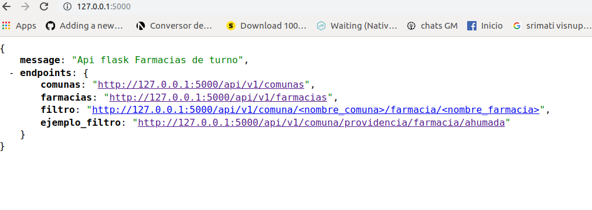
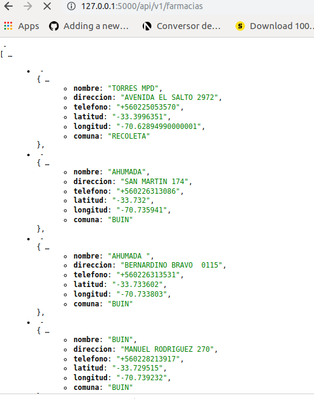
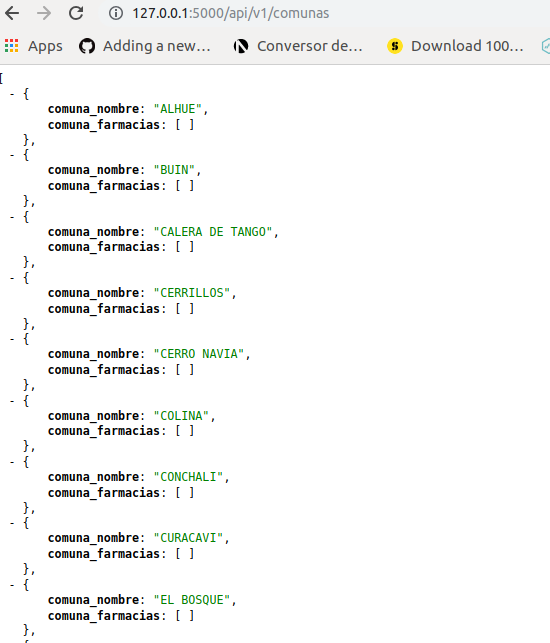
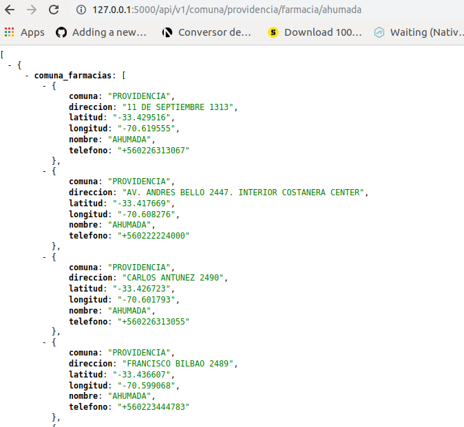

# ApiRest D-BCH

This is an API Flask

## Deploy Heroku

Run the following commands to get started running this app locally:
```RUN:
    heroku create apifarmacias
    heroku container:push web --app apifaramcias
    heroku container:release web --app apifaramcias
    heroku open
    heroku logs --tail
```

Then visit `http://localhost:5000` to play with the app.

## Running Docker
```
    sudo docker build -t flaskapi:latest .
    sudo docker run --rm -it -v $(pwd)/api_flask:/api_flask -p 5000:5000 --network=host flaskapi
```

### INICIO


### ENDPOINT FARMACIAS

### ENDPOINT COMUNAS

### ENDPOINT FILTROS

## Licensing

This example is open-sourced software licensed under the
[MIT license](https://opensource.org/licenses/MIT).
